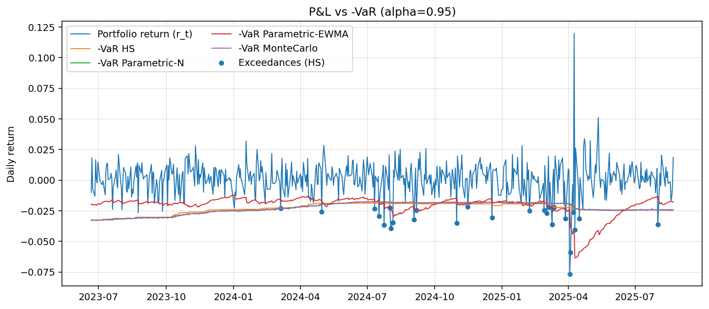
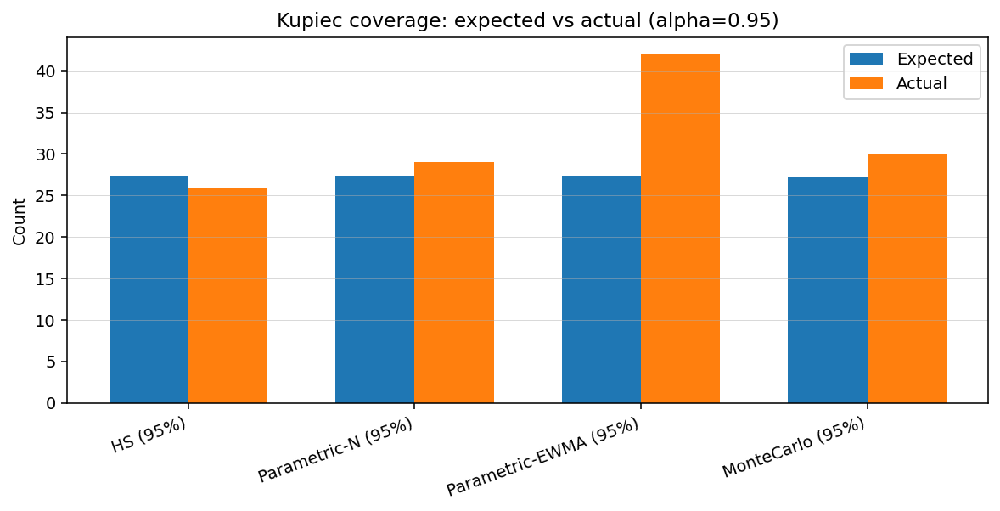
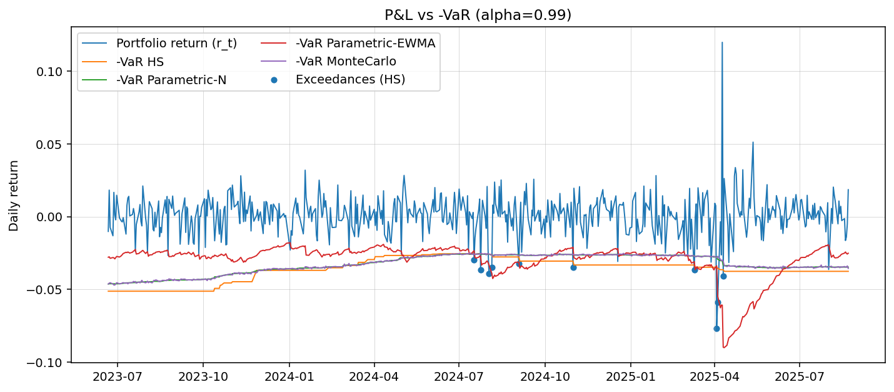
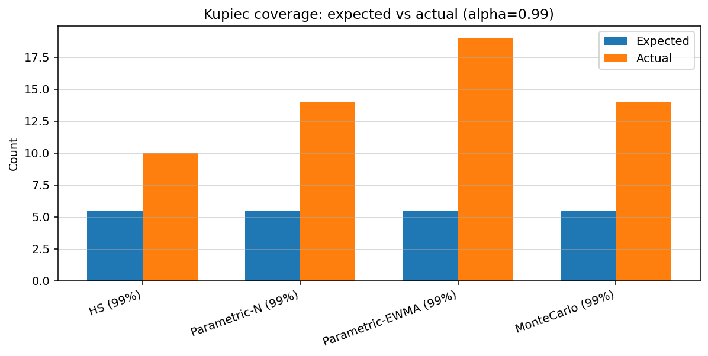
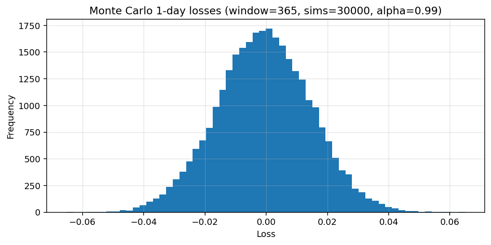

# Market Risk Modeling: VaR, Backtesting (Kupiec/Christoffersen) & Simple Stress Views

End-to-end, **portfolio 1-day VaR** modeling and **backtesting** project:
- Methods: **Historical (HS)**, **Parametric (Variance–Covariance, Normal & EWMA)**, **Monte Carlo (MVN)**
- Confidence levels: **95%** & **99%**
- Backtests: **Kupiec POF**, **Christoffersen independence**, **LRcc**
- Simple, useful **plots** for quick inspection

> Data source: Yahoo Finance via `yfinance`. Example universe mixes liquid equities; portfolio returns are computed from log-returns and user weights.
>
>

 
  
   

---

## 🧱 Project structure

src/varlib/        # data ingest, returns, and VaR model implementations    
backtests/         # Kupiec, Christoffersen, LRcc & helpers      
reports/figs/      # exported figures (committed samples below)      
main.py            # runnable script (change tickers/weights here)      

---

## 📈 Figures (key visuals)

These are committed sample outputs (your numbers will vary over time as markets move).

1) **P&L vs -VaR (α = 0.99)**  
Shows daily portfolio return and -VaR lines; blue dots mark exceedances for the highlighted method.  

2) **Kupiec coverage (α = 0.95)**  
Expected vs actual exceedance counts (should be close if coverage is good).  

3) **Kupiec coverage (α = 0.99)**  
Typically the toughest—fat tails/vol regime shifts show up here.  

4) **Monte Carlo 1-day loss histogram (α label for context)**  
Shape/scale intuition for simulated one-day losses; not a validation by itself.  

---

## 📊 Methods (1-day)

- **Historical VaR (HS):** empirical quantile of rolling window losses.  
- **Parametric (Var–Covar):**  
  - Normal assumption (mean, stdev on a rolling window)  
  - Optional **EWMA** volatility (RiskMetrics-style) for conditional variance  
- **Monte Carlo (MVN):**  
  - Mean vector and covariance from the rolling window  
  - Cholesky to simulate correlated one-day returns; portfolio losses via weights  
- **ES (CVaR):** available alongside VaR (mean loss beyond VaR threshold)

**Backtests:**
- **Kupiec POF** (unconditional coverage)  
- **Christoffersen** (independence)  
- **LRcc** = combined (coverage + independence)

---

## ✅ Example results (sample run)

`T ≈ 546–547` trading days.

**Expected exceedances:**  
- 95%: `p = 5%` → ≈ 27.4  
- 99%: `p = 1%` → ≈ 5.5

### 95% level

| Method                 |   T | Exceed | Kupiec p | Christ p | LRcc p |
|------------------------|----:|-------:|---------:|---------:|-------:|
| HS (95%)               | 547 |     26 |   0.7895 |   0.1522 |  0.3463 |
| Parametric-N (95%)     | 547 |     29 |   0.7484 |   0.2649 |  0.5103 |
| Parametric-EWMA (95%)  | 547 |     42 | **0.0075** | 0.1284 | **0.0088** |
| MonteCarlo (95%)       | 546 |     30 |   0.6015 |   0.3128 |  0.5242 |

**Takeaway:** HS, Parametric-N, and MC pass combined coverage; **EWMA under-covers** (too many breaches).

### 99% level

| Method                 |   T | Exceed | Kupiec p | Christ p | LRcc p |
|------------------------|----:|-------:|---------:|---------:|-------:|
| HS (99%)               | 547 |     10 |  0.0810  | **0.0099** | **0.0078** |
| Parametric-N (99%)     | 547 |     14 | **0.0022** | **0.0454** | **0.0012** |
| Parametric-EWMA (99%)  | 547 |     19 | **0.0000** | 0.6867 | **0.0000** |
| MonteCarlo (99%)       | 546 |     14 | **0.0021** | **0.0455** | **0.0012** |

**Takeaway:** All models under-cover at 99% (fat tails / stress correlations).

> Results are time-varying; re-run `main.py` to refresh tables and figures.

---

## ⚙️ Configuration

Edit in `main.py`:
- `tickers`, `weights`
- `alpha_levels`, `window`
- MC simulations: `n_simulations`

All models are **rolling, out-of-sample** (today’s VaR uses info up to `t-1`).

---

## 🔭 Roadmap (nice to have)

- Parametric **Student-t** (drop-in replacement for Normal)  
- **Filtered Historical Simulation (FHS)**  
- **GARCH(1,1)** with t-errors (via `arch`)  
- **ES backtesting** (Acerbi–Székely)  
- Lightweight **Streamlit** dashboard

---

## 📄 License

MIT
